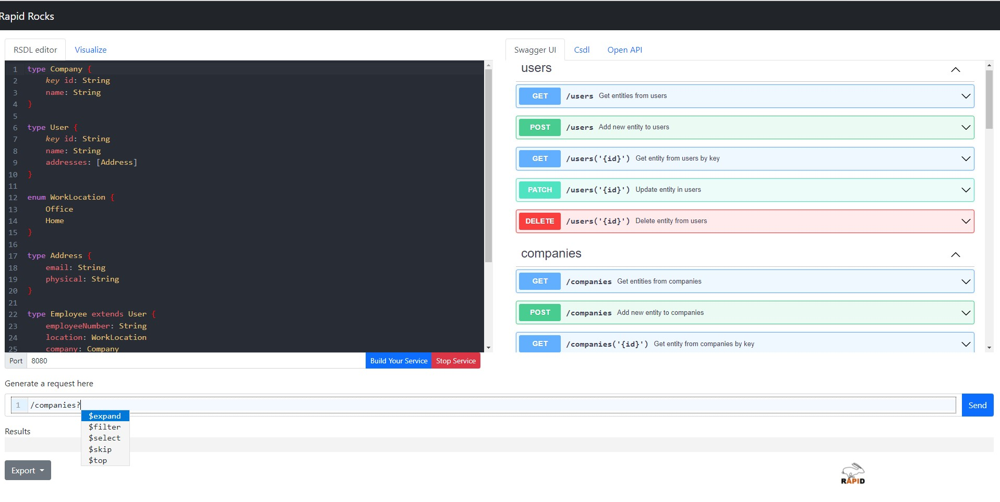

# RAPID ROCKS API DESIGNER

An experimental designer for RAPID/ODATA APIs and RSDL-based services.



## Build instructions

### Build related tools

This project depends on other tools in this repo. You have to manually build those tools first by going to their respective directories and following their build instructions (mainly a combination of `npm install` + `npm run build`):
- [odataUri](../odataUri) (referenced as `odata-uri` in `package.json`)
- [urlEditor](../urlEditor) (`odata-uri-editor`)
- [visualModelEditor](../visualModelEditor) (`visual-model-editor`)
- [rsdlEditor](../rsdlEditor) (`rsdl-editor`)

**Note**: if you make modifications to any of those dependencies and rebuild and the changes don't take effect in the API designer, try:
- uninstalling the dependency from the API designer (remove it from `package.json` and `node_modules` or run `npm uninstall`)
- adding it back to `package.json`
- running `npm run build`

**TODO**: Consider organising this project as a monorepo to make dependency management of related tools easier. The current set up is quick hack.

### Install dependencies

Run:

```
npm install
```

### Launch the app locally

```
npm start
```