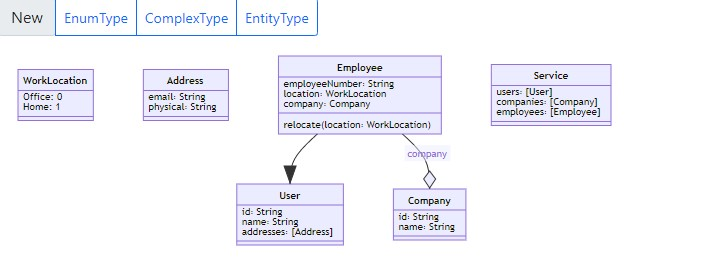

# Visual Model Editor

A visual diagramming tool for graphically designing an RSDL/OData entity data model.



## Installation and build instructions

Run

```
npm install
```

Then run:

```
npm run build
```

The build command will store the output files in the `dist` folder.

**Note**: You need to run the build command before setting up packages that depend on this library. This package is not on npm, so the dependent
packages will fetch this package from the local filesystem as is.

To add this package as a dependency to another project, add reference to this library to
the other project's `package.json` `dependencies`, the reference should be a file
path that points to this package's root folder.

```json
"dependencies": {
    "visual-model-editor": "file:path/to/visualModelEditor
}
```

## Usage

```ts
import { MermaidEditor } from "visual-model-editor";

const container = document.getElementById("visual-editor-gui-content");

const editor = MermaidEditor(
  container,
  window,
  // Subscribe to the update event.
  (rsdl) => editor.updateRsdl(rsdl)
);

// update the rsdl programmatically
editor.updateRsdl(`
type Company {
    key id: String
    name: String
}

service {
    companies: [Company]
}
`);
```

You can also load it directly in an html file. For a sample, see the [example.html](./example.html) file.
